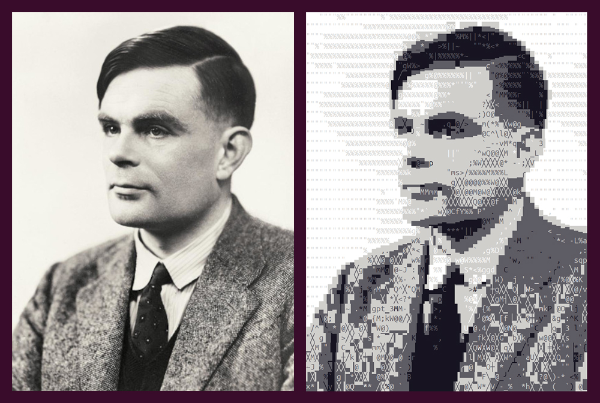
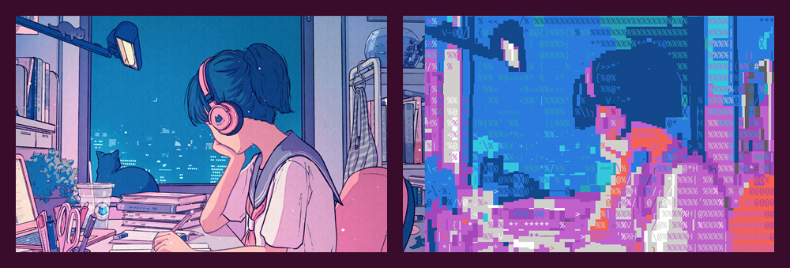
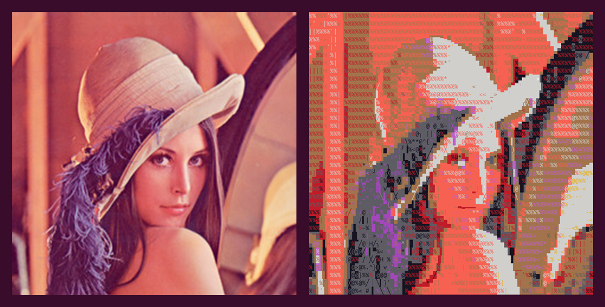
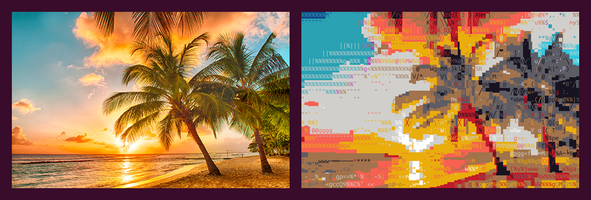

# next_level_of_ascii_art
I know that the name sounds a bit ambitious. But, have you seen the results?










## So, what is new here? 
In this case, the ASCII output is generated using standard terminal colors, and it infers the lowest-error combination of character elements — including background color, foreground color, and the actual printable character — for each section of the image.

In other words:
It’s not just a low-resolution pixel-to-character conversion. It’s an inference process that finds the most visually accurate representation of the original image, using the valid set of terminal colors and characters you provide, and based on the resolution of the final character grid.

## Usage examples:

### Activate Python virtual environment
```bash
# generate the venv
python3 setup.py
# then, on Linux use:
source .venv/bin/activate
# Or, on Widnows use:
.venv\Scripts\activate.bat 
.venv\Scripts\Activate.ps1
# Or, install the reqs in requirements.txt
```

### Create your ASCII art
```bash
python create_ascii.py my_picture.jpg       # full size terminal output
python create_ascii.py my_picture.jpg -c 30 # fix the width to 30 columns 
python create_ascii.py my_picture.jpg -r 9  # fix the height to 9 rows
```
I let some picture example images in ```media_example/``` dir to play with.

## Advanced usage:
### Use a custom calibration file
The inference process works with a calibration file, which contains data about how different combinations of printable characters appear, based on a specific terminal color theme and font.

By generating your own calibration, you can ensure the ASCII output has the lowest possible error for your terminal setup.
```bash
python create_ascii.py my_picture.jpg -C calibration/cal_default.pkl       # default calibration file, based on common terminal themes
python create_ascii.py my_picture.jpg -C calibration/cal_black_white.pkl   # calibration using only black & white colors
python create_ascii.py my_picture.jpg -C path_to_my_own_calibration_file.pkl       # use your custom calibration (see below)
```
### Choose the output quality
The inference process can take a while.
To balance speed vs. accuracy, you can choose from three quality levels. (Yes, I'm working on optimizing this with multi-core processing and with custom low level libraries.)
```bash
python create_ascii.py my_picture.jpg -q fast   # low quality    (fastest)
python create_ascii.py my_picture.jpg -q medium # medium quality (default)
python create_ascii.py my_picture.jpg -q slow   # high quality   (slowest)
```

## Calibration tool:
### Activate python virtual environment as sudo
```bash
# start a sudo session (or the equivalence on Windows)
sudo su
# activate the venv
source .venv/bin/activate # or the equivalence on Windows
```
### Advices
The calibration process works by taking screenshots of your terminal, to understand how each printable character looks with different foreground/background colors, in your current font, font size, and terminal color scheme.

Here some advices to make it well:

* DON'T MOVE THE TERMINAL WINDOW DURING THE CALIBRATION PROCESS
* Select the terminal application and color scheme that you want to use to generate ASCII art with
* Maximize the window is recommended (makes the process faster)
* Choose the correct screen index (if you have more of a single display output)
* You’ll need sudo permissions (to take screenshots programmatically)

### Run the calibration
#### Generic calibration:
By default, the calibration file will be saved in the ```calibration/``` directory.
```bash
sudo python run_calibration.py my_own_calibration_output_file_name.pkl
```
#### Use a custom color set file:
You can increase or reduce the number of characters and color combinations by editing or creating a color set ```.yaml``` file.
By default, the tool uses ```calibration/colorset_default.yaml```, but you can try others (see the calibration/ folder for examples).

* Tip: if you reduce the options number in the ```.yaml``` file, the inference process will be exponentially faster.
```bash
sudo python run_calibration.py calibration_output_file.pkl -c calibrations/colorset_yellow_black_white.yaml 
sudo python run_calibration.py calibration_output_file.pkl -c calibrations/colorset_full_print.yaml
sudo python run_calibration.py calibration_output_file.pkl -c my_own_colorset_file.yaml
```
#### Didn't work?
If coarse calibration fails, it’s likely due to an incorrect screen index. Try different values for the ```-s``` option (e.g. ```2```, ```3```, or even ```0```). The default is ```1```.

If the fine alignment process fails, possible reasons include:
* Your terminal rendering is blurry/diffuse (this depend of a lot of stuff, but mainly due to OS display scaling settings)
* Your characters are too small to be detected reliably
* Weird glitches, sometimes just moving the window a bit and retrying helps (yes, it’s weird but it works. I can explain but ...)

#### Select a screen index manually:
Using the ```-s``` flag you can specify your screen index.
```bash
sudo python run_calibration.py calibration_output_file.pkl -s 2 -c my_own_colorset_file.yaml 
```


## TODO list:
```
- multi core processing             [WIP] (coming soon ^_^ )
- Windows OS support                [WIP] (it's working now but not self set)
- dump output to a file             [done] (now is dumped on last_run_dump_{picture_name})
- C library for inference process   [hold]
- make better CLI                   [hold]
- add auto brightness-contrast tool [hold]
- picture output render             [hold]
- detect grid with better method    [hold]
- video support                     [hold]
- morphologic animation tool        [hold]
```
## Contact
santiagocian97@gmail.com

## Last but not least
Thanks Juan   ```:)```
